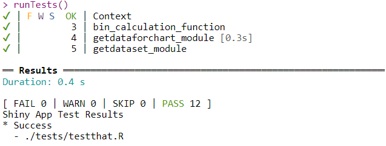
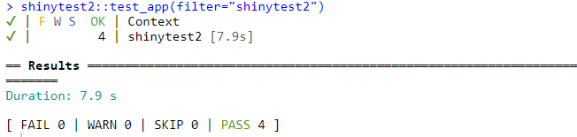

---
output:
  github_document: default
  html_document: default
---

## Last updated on `r Sys.Date()`

### testthat Testing Output (function and Module Testing)

### Shinytest2 Testing Output (Snapshot-based Testing)

###	What is application testing in SDLC?

In most cases, testing remains a consistent part of the project throughout the **SDLC**. Therefore, it is always involved in SDLC in some way or another, regardless of which phase you are currently in.

The main goal of the testing procedures is to *report*, *monitor*, *resolve* and *retest* software components until they reach the quality standards defined in the initial **SRS**. Many teams use documents such as **RTM** to trace the main requirements of the project and see how they affect each other.

###	Why is testing important?

Testing is one of the most critical processes of the **Software Development Lifecycle (SDLC)**. It helps companies to perform a comprehensive assessment of software and ensure that their product fulfills the client’s needs.

The testing phases of the software development lifecycle help companies to identify all the `bugs` and `errors` in the software before the implementation phase begins. If software bugs are not resolved before deployment, they can adversely affect the client’s business.

Besides that, trying to resolve these issues at a later stage can incur substantial costs. The more you delay the detection of these issues, the greater the cost you are likely to face.

There are several ways to perform testing in the software development lifecycle. The techniques used for testing can vary depending on the software development model, the stage of the process, and the objectives of the testing procedure.

### How to test in R/Shiny?
  
  **Automated testing** is essential for making sure that code works the way that you intend it to, and keeps working even after you make changes to the code. There are following type of testing for shiny applications:
  
* **Unit tests:** These are used to test that functions behave as expected.
* **Server function tests:** These tests run the server function of a Shiny application in an environment that simulates a real      client session. They can be used to test reactive components and outputs in the server function of a Shiny application, or      in   a module.
* **Snapshot-based tests:** These are tests performed with the shinytest package, which runs the Shiny application in a            headless     web browser. The web browser connects to the Shiny application and simulates user actions, such as clicking on     buttons and     setting inputs to particular values. It takes snapshots of the application state and, in future runs of the     tests, compares    the application state to those saved snapshots.

For unit tests and server function tests, no web browser is involved, and the tests and test expectations are expressed in R code. This means that the tests run quickly, and that changing code in one part of an application will generally not affect tests of another part of the application.The snapshot-based tests require a headless web browser, and, as the name suggests, use snapshots.

**testthat** package is used to build the unit and server functions tests and **shinytest2** package is used to perform the snapshot-based tests.

### What is testthat? 

<!-- badges: start -->

<!-- badges: end -->

Testing your code can be painful and tedious, but it greatly increases the quality of your code. __testthat__ tries to make testing as fun as possible, so that you get a visceral satisfaction from writing tests. Testing should be addictive, so you do it all the time. To make that happen, testthat:

* Provides functions that make it easy to describe what you expect a
  function to do, including catching errors, warnings, and messages.

* Easily integrates in your existing workflow, whether it's informal testing
  on the command line, building test suites, or using R CMD check.

* Displays test progress visually, showing a pass, fail, or error for every
  expectation. If you're using the terminal or a recent version of RStudio, 
  it'll even colour the output.

testthat draws inspiration from the xUnit family of testing packages, as well as from many of the innovative ruby testing libraries, like [rspec](https://rspec.info/), [testy](https://github.com/ahoward/testy), [bacon](https://github.com/leahneukirchen/bacon) and [cucumber](https://cucumber.io). 

testthat is the most popular unit testing package for R and is used by thousands of CRAN packages. 

###	How to automate/implement testing in R?

Tests are organized into three levels:

* **File.** All test files live in tests/testthat, and each test file should correspond to a code file in R/, e.g. the code in R/module.R should be tested by the code in tests/testthat/test-module.R. Fortunately you don’t have to remember that convention: just use [usethis::use_test](https://github.com/r-lib/usethis) to automatically create or locate the test file corresponding to the currently open R file. If you're using RStudio, press Cmd/Ctrl + Shift + T to run all the tests in a package.

* **Test.** Each file is broken down into tests, i.e. a call to test_that(). A test should generally check a single property of a function. It’s hard to describe exactly what this means, but a good heuristic is that you can easily describe the test in the first argument to [test_that](https://testthat.r-lib.org/index.html).

* **Expectation.** Each test contains one or more expectations, with functions that start with expect_. These define exactly what you expect code to do, whether it’s returning a specific value, throwing an error, or something else. You can click on [this link](https://testthat.r-lib.org/reference/index.html) to see the details of all **expect** functions

The art of testing is figuring out how to write tests that clearly define the expected behaviour of your function, without depending on incidental details that might change in the future.

Below link will help to read more about **testthat**:

* [Overview](https://testthat.r-lib.org/index.html)
* [Masterting Shiny Book - Testing](https://mastering-shiny.org/scaling-testing.html)

